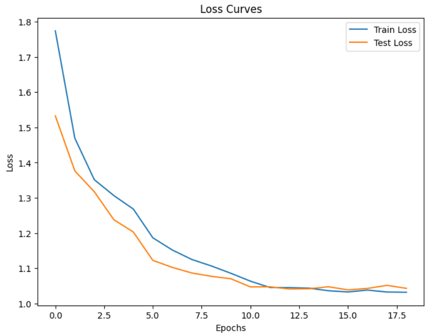

# Custom CNN Model for FER2013

A deep learning model for classifying facial expressions in the FER2013 dataset using a custom Convolutional Neural Network (CNN) architecture. The model leverages various techniques to manage overfitting and optimize performance, achieving an accuracy of 61%.

## Dataset
The **FER2013** dataset is a widely used benchmark for facial expression recognition. It contains **35,887 grayscale images** with a resolution of **48x48 pixels**. Each image represents one of seven emotions:

- Angry
- Disgust
- Fear
- Happy
- Sad
- Surprise
- Neutral

### Dataset Challenges
The FER2013 dataset presents challenges such as limited and imbalanced samples per class. This imbalance, along with inherent noise, can lead to overfitting, making it challenging to achieve high generalization and accuracy.

## Techniques for Reducing Overfitting 
This CNN model incorporates several techniques to enhance performance while managing overfitting:

- **Batch Normalization**: Stabilizes learning and accelerates convergence.
- **Dropout**: Helps prevent overfitting by randomly dropping neurons during training.
- **Data Transformation**: Real-time transformations enhance model generalization.
- **Weight Decay**: Regularization technique added to the optimizer to penalize large weights.
- **Optimizer Scheduler**: Dynamically adjusts the learning rate to improve training stability.
- **Adam Optimizer**: Used as the main optimizer for efficient learning.

## Evaluation Metrics
The model's performance is evaluated using the following metrics:

- **Accuracy**: Overall percentage of correctly classified images.
- **Precision**: Precision score for each emotion class.
- **Recall**: Recall score for each emotion class.
- **F1-Score**: Harmonic mean of precision and recall for each class.
- **Confusion Matrix**: Visual representation of correct and incorrect predictions per class.

### Model Performance
- **Training Accuracy**: 61%
- Detailed metrics (Precision, Recall, F1-Score) are provided in the results section.

## Results
Training loss, validation loss, and confusion matrix visualizations demonstrate the model’s learning progress and class-wise performance.

### Loss Curve


### Confusion Matrix


## Installation and Usage

1. Clone the repository:
   ```bash
   git clone https://github.com/wajee-ul-hassan/FER2013-Emotion-Detection-CNN
   ```

2. Install dependencies:
   ```bash
   pip install -r requirements.txt
   ```


## Model Summary

## Future Improvements
- Experiment with more advanced data augmentation techniques.
- Explore alternative architectures like ResNet or VGG with transfer learning.
- Address class imbalance through oversampling or class weighting.

## License
This project is licensed under the MIT License. See the LICENSE file for details.

## Acknowledgments
- [FER2013 Dataset on Kaggle](https://www.kaggle.com/datasets/msambare/fer2013)

---

